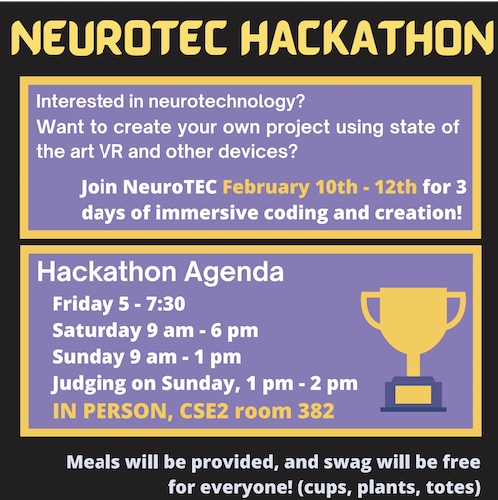
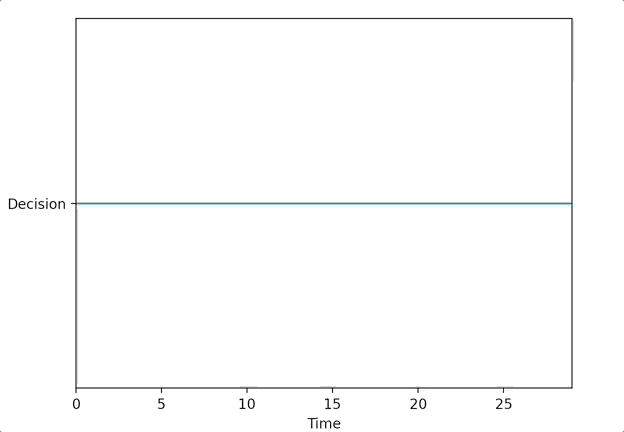
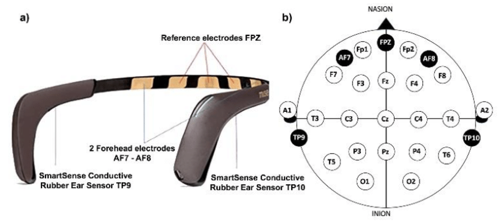
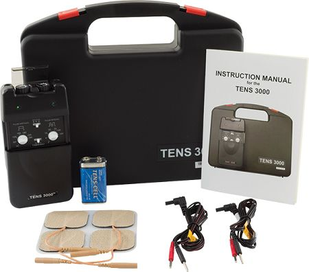
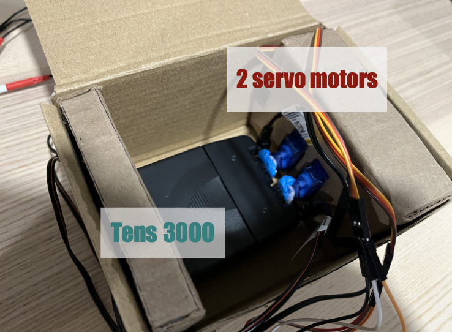
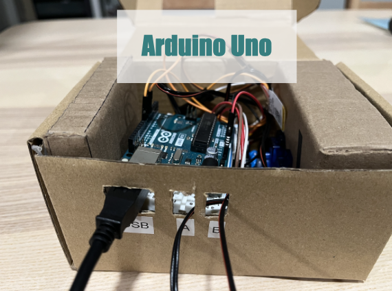
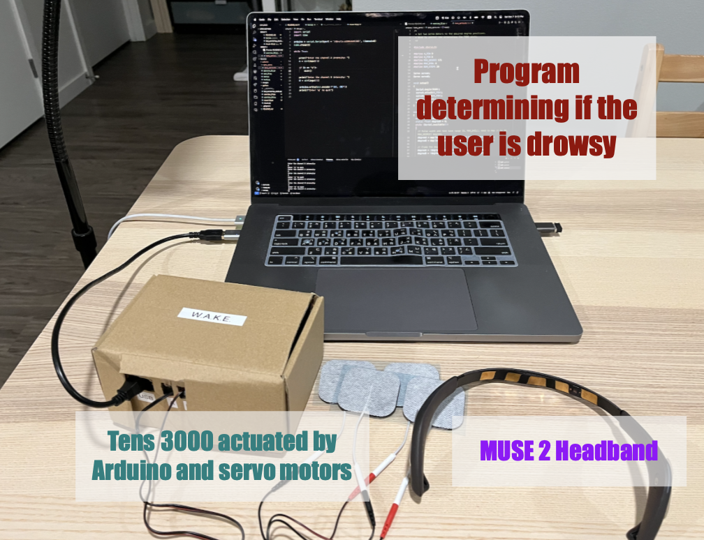
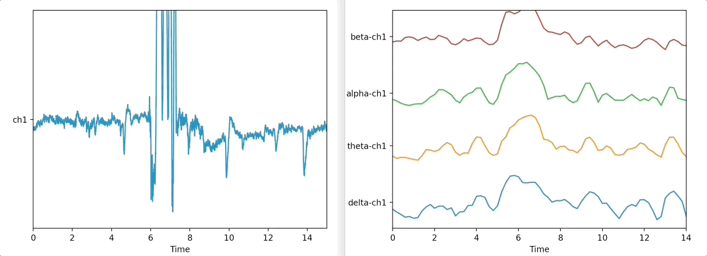
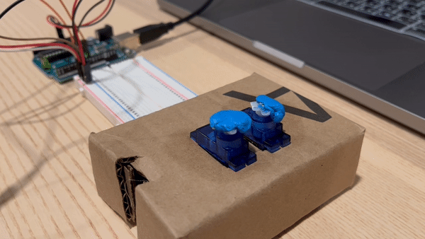

# W.A.K.E Documentation

This repository contains code and documentation for Wearable Alertness and Kinesis Equipment (W.A.K.E).

**Team Members**: Jarod Marshel, Chonghao Cai, Chenhan Dai, Alessandro Bifulco, Tony Fu

---

## Introduction

Our team developed this project for the NeuroTEC x Synaptech 2023 Hackathon. The hackathon lasted three days and focused on neurotechnology prototypes. We used the MUSE 2 headband and the TENS 3000 unit. Our goal was to help people stay awake by detecting changes in brainwaves and stimulating the body.

*Note: We wrote this documentation months after the event, so some details are missing.*



---

## Results

Our SVM trained using 20 seconds of eye open and eye close data (total 40 seconds) at the start of the program achieved a pretty responsive performance. The following plot shows the SVM's prediction vs. the state of the subject.



[View Presentation Slides](https://prezi.com/view/d1VaiqtHbyYKQhuBqlw4/): Credit to Jarod Marshel for making the slides.

**Spoiler**: We didn't win the hackathon. The winning project, which also used a MUSE 2 headband and an Oculus Quest 3, stood out for its creative use of VR. Our project raised concerns about resembling a torture device, a critique we found reasonable.

---

## Hardware Components

### MUSE 2 Headband

The MUSE 2 headband comes with 2 active EEG sensors (AF7 and AF8) and 3 reference sensors (Fp1, Fp2, FpZ) on the forehead and 2 sensors behind the ears (TP9 and TP10). We can also optionally plug in an auxiliary sensor (AUX_RIGHT) to the micro-USB port.



Figure source: [MUSE 2 Specs](https://ifelldh.tec.mx/sites/g/files/vgjovo1101/files/Muse_2_Specifications.pdf)

To connect the MUSE 2 to a computer, you need a BLED112 USB dongle ([Here is the one I use](https://www.digikey.com/en/products/detail/silicon-labs/BLED112-V1/4245505)) because most computers lack stable BLE support.

### TENS 3000 Unit

The TENS 3000 unit is a pain relief device. It sends small electric currents through electrodes placed on the skin. We used it because its tingling sensation can help keep people awake.



You can buy it from the [TENS Pro Official Website](https://www.tenspros.com/tens-3000-analogue-tens-unit-dt3002.html).

### Arduino Uno and Servo Motors

The TENS 3000 only has manual dials for electrical intensity. We used an Arduino Uno and servo motors to turn these dials. We built a cardboard housing to maintain pressure on the dials.





### Final Setup



---

## Software Details

Please allow us to present this section in the form of a tutorial.

### Step 1. Connecting to the MUSE 2

For those who wants to develop their own MUSE 2 applications, please refer to [this repository by NueroTechX](https://github.com/NeuroTechX/bci-workshop) for starter code and tutorials. In short, we will use the following Python libraries:

- `pylsl`: the interface to the Lab Streaming Layer (LSL), a protocol for real-time streaming of biosignal over a network. Here is their [documentation](https://labstreaminglayer.readthedocs.io/). Here are some [example code](https://github.com/labstreaminglayer/pylsl/tree/master/pylsl/examples). Here is a [YouTube tutorial on LSL](https://youtu.be/Y1at7yrcFW0?si=V298gu2gYSO6tr3a).
- `sklearn`: for machine learning
- `scipy`: for signal processing
- `seaborn`: for data visualization
- Other libraries for connecting via the BLED112 USB dongle: `pygatt`, `bitstring`, `pexpect`. You can install those three libraries with the following command:

```bash
pip install git+https://github.com/peplin/pygatt pylsl bitstring pexpect
```

To connect to the MUSE 2, you need to first pair the MUSE 2 with your computer. You can do this with the following command:

```bash
python3 muse-lsl.py --name <YOUR_DEVICE_NAME>
```

The `<YOUR_DEVICE_NAME>` is the name of your MUSE 2. This information could be found on the box of your MUSE 2. For example, our MUSE 2's name is `Muse-E02A`. This command will establish a connection between your computer and the MUSE 2. Closing this window will result in a disconnection. If the program is complaining about not finding the MUSE 2: try restarting the MUSE 2, double-check the address, and make sure the MUSE 2 is not connected to any other devices.

#### Under the Hood of `muse-lsl.py`

The purpose of `muse-lsl.py` is to put our MUSE 2 device on the LSL network, so that other programs can fetch the device's data from LSL.

At the start of the program, we need to import the LSL library.

```python
from pylsl import StreamInfo, StreamOutlet, local_clock
```

Then, we need to construct a new [`StreamInfo`](https://labstreaminglayer.readthedocs.io/projects/liblsl/ref/streaminfo.html?highlight=streaminfo) object.

```python
info = info = StreamInfo(name='Muse', type='EEG', channel_count=5, nominal_srate=256, channel_format='float32', source_id=options.name)  # name is command line argument, e.g. Muse-E02A
```

The `name` can actually be anything you want. It is just used to find the stream on the LSL network. The `type` is the type of data we are streaming. Refer to this page to see [all the available types](https://github.com/sccn/xdf/wiki/Meta-Data). We have 5 channels. All have a sampling rate of 256 Hz, and the format is `float32`. `source_id` is required. It is the unique identifier of the device.

The `StreamInfo` object provides a `desc()` method that allow the user to extend the metadata of the stream, so that other programs can understand the data. For example, we can add the manufacturer of the device and the labels of the channels.

```python
info.desc().append_child_value("manufacturer", "Muse")
channels = info.desc().append_child("channels")

for c in ['TP9', 'AF7', 'AF8', 'TP10', 'Right AUX']:
    channels.append_child("channel") \
        .append_child_value("label", c) \
        .append_child_value("unit", "microvolts") \
        .append_child_value("type", "EEG")
```

So far, we only created a `StreamInfo` object, but how to make this stream available on the LSL network? We need to create a [`StreamOutlet`](https://labstreaminglayer.readthedocs.io/projects/liblsl/ref/outlet.html) object. We need to pass the `StreamInfo` object to the constructor of `StreamOutlet`. Also, for performance reasons, let's make the stream "upload" data in chunks of 12 samples, and buffer up to 6 minutes (360 seconds) of data.

```python
outlet = StreamOutlet(info=info, chunk_size=12, max_buffered=360)
```

The rest of the code involves connecting the MUSE 2 to the `StreamOutlet`. This is better handled using an object-oriented approach. We will create a `Muse` class that handles the connection. It is has four public methods:

- `connect()`: find the MUSE 2, connect to it (using `pygatt`), subscribe to its channels (UUIDs), and register a callback function to handle the data.
- `start()`: initialize the data and timestamp variables.
- `stop()`: stop the data stream.
- `disconnect()`: disconnect from the MUSE 2.


```python
muse = Muse(callback=process, time_func=local_clock, name=options.name) # name is command line argument, e.g. Muse-E02A

muse.connect()
muse.start()

while 1:
    try:
        sleep(1)
    except:
        break

muse.stop()
muse.disconnect()
```

The `process` function is the callback function that handles the data. It uses the `StreamOutlet.push_sample()` method to push the data to the LSL network 12 samples at a time.

```python
def process(data, timestamps):
    for ii in range(12):
        outlet.push_sample(data[:, ii], timestamps[ii])
```


---


### Step 2. "Hello World": Data Streaming

In Step 1, we established a connection between the MUSE 2 and the computer. Specifically, we put the EEG data from our MUSE 2 on the LSL network. Now, as a "Hello World" exercise,let's see how we can fetch the data from the LSL network. We will use the `pylsl` library again.

Open a new terminal window and run the following command:

```bash
python3 exercise_01.py
```

This will run the `exercise_01.py` program provided by NeuroTechX (also available in this repository). This program will plot the data from the MUSE 2. You should see something like this:



We are plotting the left ear (TP9) EEG data. The left plot shows the raw signal, and the right shows the signal being broken down into four frequency bands: delta (< 4 Hz), theta (4 - 8 Hz), alpha (8 - 12 Hz), and beta (12 - 30 Hz). The three spikes in the raw signal correspond to the three blinks I made while recording the data.

#### Under the Hood of `exercise_01.py`

##### Step 2.1 Connecting to the EEG stream

We will first import the LSL library as well as the `bci_workshop_tools` library provided by NeuroTechX.

```python
from pylsl import StreamInlet, resolve_byprop
import bci_workshop_tools as BCIw
```

The `resolve_byprop()` function will find the stream on the LSL network. We will use the `name` property to find the stream. Since there is only one stream on the network, we can just use the first element of the list returned by `resolve_byprop()`.

```python
streams = resolve_byprop('type', 'EEG', timeout=2)

if len(streams) == 0:
    raise RuntimeError('Can\'t find EEG stream.')

inlet = StreamInlet(streams[0], max_chunklen=12)
```

We need to apply a [time correction](https://labstreaminglayer.readthedocs.io/info/time_synchronization.html?highlight=time%20correction#synchronization-process-offset-correction) to the data. This is because the data is not synchronized with the computer's clock.

```python
_ = inlet.time_correction()
```

Of course, we have access to the `StreamInfo` object that we defined in `muse-lsl.py`. We can use it to get the sampling rate and the channel labels.

```python
info = inlet.info()
# Get the stream info and description
info = inlet.info()
desc = info.desc()
fs = int(info.nominal_srate())

# Get the channels names
labels = []
channels = desc.child("channels").first_child()
while not channels.empty():
    labels.append(channels.child_value("label"))
    channels = channels.next_sibling()
```

##### Step 2.2 Set plot parameters

Let's set some parameters for plotting. We are using a 15-second buffer, and we will plot the data in 1-second epochs. We will also set the overlap between two consecutive epochs to be 0.8 seconds. This means that the start of each epoch will be shifted by 0.2 seconds.

```python
buffer_length = 15      # in seconds
epoch_length = 1        # in seconds
overlap_length = 0.8    # overlap between two consecutive epochs (in seconds)

# Amount to 'shift' the start of each next consecutive epoch
shift_length = epoch_length - overlap_length

# Index of the channel (electrode) to be used
index_channel = [0]
ch_names = [labels[i] for i in index_channel]

# Get names of band frequencies (e.g., 'alpha', 'beta')
feature_names = BCIw.get_feature_names(ch_names)
```

The "features" here are the frequency bands. We will use the `get_feature_names()` function provided by NeuroTechX to get the names of the frequency bands.

##### Step 2.3 Initialize the buffer

We need to initialize the buffer for storing the data. We will use a 2D NumPy array. The first dimension is the number of samples, and the second dimension is the number of channels. We will also initialize the filter state for the notch filter.

We are making two plots: one for the raw EEG data and one for the frequency bands. We will use the `DataPlotter` class provided by NeuroTechX to make the plots. The `DataPlotter` class is a wrapper around the `matplotlib` library. It is a convenient way to plot data in real-time.

##### Step 2.4 Fetch the data

We then enter a while loop to fetch the data from the LSL network. We will fetch the data in chunks of 12 samples. We will also update the EEG buffer and the feature buffer. We will get into the details of feature extraction in Step 3.

```python
print('Press Ctrl-C in the console to break the while loop.')

try:
    while True:

        """ 4.1 ACQUIRE DATA """
        # Obtain EEG data from the LSL stream
        eeg_data, timestamp = inlet.pull_chunk(
            timeout=1, max_samples=int(shift_length * fs))

        # Only keep the channel we're interested in
        ch_data = np.array(eeg_data)[:, index_channel]

        # Update EEG buffer
        eeg_buffer, filter_state = BCIw.update_buffer(
            eeg_buffer, ch_data, notch=True,
            filter_state=filter_state)

        """ 4.2 COMPUTE FEATURES """
        # Get newest samples from the buffer
        data_epoch = BCIw.get_last_data(eeg_buffer,
                                        epoch_length * fs)

        # Compute features
        feat_vector = BCIw.compute_feature_vector(data_epoch, fs)
        feat_buffer, _ = BCIw.update_buffer(feat_buffer,
                                            np.asarray([feat_vector]))

        """ 4.3 VISUALIZE THE RAW EEG AND THE FEATURES """
        plotter_eeg.update_plot(eeg_buffer)
        plotter_feat.update_plot(feat_buffer)
        plt.pause(0.00001)

except KeyboardInterrupt:
    print('Closing!')
```

Notice the use of `StreamInlet.pull_chunk()`. This function will fetch the data from the LSL network. It will return a tuple of two elements: the first element is a 2D NumPy array of shape `(n_samples, n_channels)`, and the second element is a 1D NumPy array of shape `(n_samples,)` containing the timestamps of the samples. We will only keep the channel we are interested in. We will also update the EEG buffer and the feature buffer.

---

### Step 3. Train a Support Vector Machine (SVM) Classifier

In Step 2, we learned how to fetch the data from the LSL network and break them up into features. Now, we will modify the `exercise_01.py` program to train a Support Vector Machine (SVM) classifier. 

#### Under the Hood of `wake.py`

We will keep the code for Step 2.1 and 2.2, but we will modify the code for Step 2.3 and 2.4.

##### Step 3.3 Record traning data

We found that 20 seconds of data is enough to train the classifier. Here we will use the `say` command of macOS to tell the user to open and close their eyes. We will record the data while the user is opening their eyes and while the user is closing their eyes. We will use the `epoch()` function provided by NeuroTechX to divide the data into epochs.


##### Step 3.4 Train the classifier

We will build a feature matrix for each class (open eyes and close eyes). Feature matrix is a 2D NumPy array of shape `(n_epochs, feature_vector.length)` where `n_epochs` is the number of epochs and `feature_vector.length` is the length of the feature vector. An epoch of feature vector is computed with  `compute_feature_vector()` function, and can be broken down into 7 steps:

```python
# 1. Compute the PSD
winSampleLength, nbCh = eegdata.shape

# 2. Remove offset
dataWinCentered = eegdata - np.mean(eegdata, axis=0)

# 3. Apply Hamming window
w = np.hamming(winSampleLength)
dataWinCenteredHam = (dataWinCentered.T*w).T

# 4. Compute the FFT (Fast Fourier Transform)
NFFT = nextpow2(winSampleLength)
Y = np.fft.fft(dataWinCenteredHam, n=NFFT, axis=0)/winSampleLength
PSD = 2*np.abs(Y[0:int(NFFT/2), :])
f = fs/2*np.linspace(0, 1, int(NFFT/2))

# 5. Compute the band power
# Delta <4
ind_delta, = np.where(f < 4)
meanDelta = np.mean(PSD[ind_delta, :], axis=0)
# Theta 4-8
ind_theta, = np.where((f >= 4) & (f <= 8))
meanTheta = np.mean(PSD[ind_theta, :], axis=0)
# Alpha 8-12
ind_alpha, = np.where((f >= 8) & (f <= 12))
meanAlpha = np.mean(PSD[ind_alpha, :], axis=0)
# Beta 12-30
ind_beta, = np.where((f >= 12) & (f < 30))
meanBeta = np.mean(PSD[ind_beta, :], axis=0)

# 6. Concatenate features in feature vector
feature_vector = np.concatenate((meanDelta, meanTheta, meanAlpha,
                                    meanBeta), axis=0)

# 7. Logarithmic scale
feature_vector = np.log10(feature_vector)
```

Once we get our feature matrices, we can quickly train a support vector machine (SVM) classifier using the `train_classifier()` function:

```python
def train_classifier(feature_matrix_0, feature_matrix_1, algorithm='SVM'):
    # Create vector Y (class labels)
    class0 = np.zeros((feature_matrix_0.shape[0], 1))
    class1 = np.ones((feature_matrix_1.shape[0], 1))

    # Concatenate feature matrices and their respective labels
    y = np.concatenate((class0, class1), axis=0)
    features_all = np.concatenate((feature_matrix_0, feature_matrix_1),
                                    axis=0)

    # Normalize features columnwise
    mu_ft = np.mean(features_all, axis=0)
    std_ft = np.std(features_all, axis=0)

    X = (features_all - mu_ft) / std_ft

    # Train SVM using default parameters
    clf = svm.SVC()
    clf.fit(X, y)

    return clf, mu_ft, std_ft
```

This function returns a trained classifier, the mean of the feature matrix, and the standard deviation of the feature matrix. We will use the mean and standard deviation to normalize the feature matrix in the future like so:

```python
# Normalize feature_vector
x = (new_feature_vector - mu_ft) / std_ft
y_hat = clf.predict(x)
```

---

### Step 4. Controlling the TENS 3000 Unit with Arduino



#### Step 4.1 Write an Arduino Sketch

We will use the Arduino Uno to control the TENS 3000 unit. The sketch will receive two numbers (separated by a comma) from the serial port because we have two dials on the TENS 3000 unit. The sketch will then use the `Servo` library to control the servo motors. Please refer to [`tens_servo.ino`](./arduino/tens_servo/tens_servo.ino) for the full code. Upload the sketch to the Arduino Uno.

You can use [`test_servo.py`](./arduino/test_servo.py) to test if the servo motors are working properly.

#### Step 4.2 Modify `wake.py` to send data to Arduino

We will modify the `wake.py` program to send the two numbers to the Arduino Uno. We will use the `pyserial` library to communicate with the Arduino Uno. We will also use the `time` library to add a delay between each data point. This is because the Arduino Uno cannot process the data fast enough. Please refer to [`wake.py`](./python/wake.py) for the full code.

---

### Step 5. Putting Everything Together

Lastly, we can assemble the hardware components. We will use a cardboard box to hold the TENS 3000 unit, Arduino Uno, and the servo motors, while only exposing the USB wire and the electrodes.


Now, we can connect the MUSE 2 and Arduino to the computer. We will run the `wake.py` (but remember to start the streaming first using `muse-lsl.py`). 


